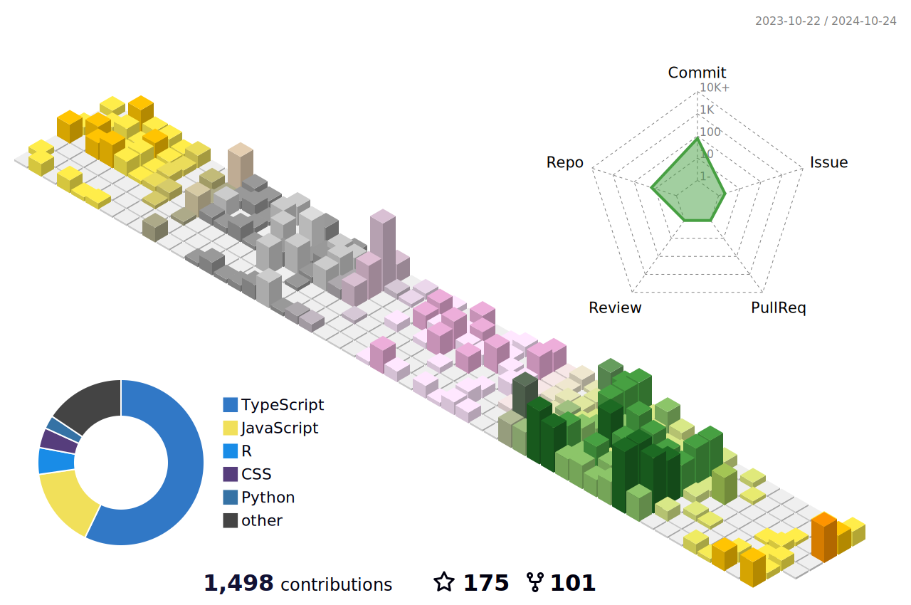

### Hi there 👋 I am Mufasa.
## Who is Mufasa? 
male? female? it is not important, what important is he/she is senior developer.
so let's call him/her just Mufasa, or Fasa.
she/he like and enjoy code. 
having more than 5 years of frontend development and worked in over 30 project with several team.(live project only)
but this is not the end, he/she has many side skills.
if some one think he/she is web developer, it is wrong, 
he/she was mobile developer at beginning of coding. 
this means he/she is not only web developer but also mobile developer as well.
although he/she is working in frontend project in these days, but it is fact that he/she has high skill and rich experience in both side.
many clients, worked with him/her so far, will remember that.
he/she is now working on another side, now we can call him/her contract developer, because he/she is working in several NFT marketplace projects.
fast leaner and hard coder is other name of him/her which his team members and client's are calling.
he/she will spend half of his/her life with coding. or may be almost till reach end of life.

<!--
**** is a ✨ _special_ ✨ repository because its `README.md` (this file) appears on your GitHub profile.

Here are some ideas to get you started:

- 🔭 I’m currently working on ...
- 🌱 I’m currently learning ...
- 👯 I’m looking to collaborate on ...
- 🤔 I’m looking for help with ...
- 💬 Ask me about ...
- 📫 How to reach me: ...
- 😄 Pronouns: ...
- ⚡ Fun fact: ...
-->

  
  
  

